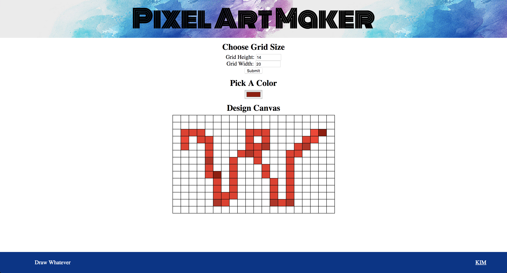

# Pixel Art Maker Project

**ENGLISH**: 
This is a "Pixel Art Maker" project of [Udacity](https://www.udacity.com/)'s _[Front-End Web Developer Nanodegree](https://www.udacity.com/course/front-end-web-developer-nanodegree--nd001)_ as practice.

**한국어**: 
[Udacity](https://www.udacity.com/)의 _[Front-End Web Developer Nanodegree](https://www.udacity.com/course/front-end-web-developer-nanodegree--nd001)_ 연습문제로 진행한 "Pixel Art Maker" 프로젝트입니다.

## Table of Contents

* [Instructions](#instructions)
* [Contributing](#contributing)

## Instructions

You can draw a pixel art work by this. 
Decide sizes of canvas as you want, and make some cool drawings using various colors!

## Contributing

